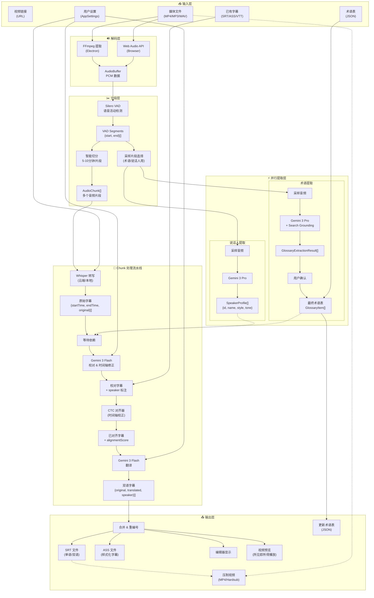
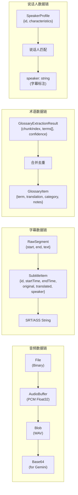
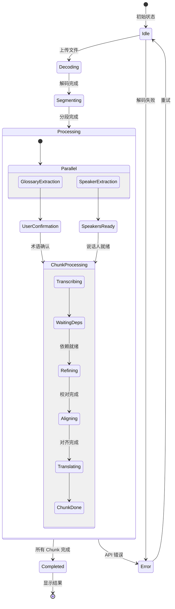
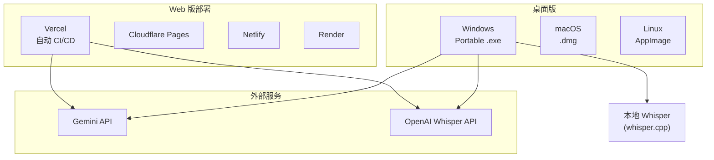

# 核心模块

各核心服务模块的详细说明。

## 1. 生成服务模块 (`src/services/generation/`)

这是重构后的核心业务逻辑模块，将原有的 Gemini API 逻辑按职责拆分：

| 子模块       | 文件/目录               | 功能描述                                                                |
| ------------ | ----------------------- | ----------------------------------------------------------------------- |
| `pipeline`   | `index.ts`              | 生成流程总管 (Orchestrator)，协调转写、提取、生成全流程                 |
|              | `pipelineCore.ts`       | 共享上下文与依赖注入                                                    |
|              | `chunkProcessor.ts`     | 单个 Chunk 的处理逻辑 (转写 -> 术语/说话人等待 -> 翻译)                 |
|              | `translation.ts`        | 具体翻译执行逻辑                                                        |
|              | `glossaryHandler.ts`    | 术语应用逻辑                                                            |
|              | `resultTransformers.ts` | 结果转换与后处理逻辑                                                    |
|              | `core/BaseStep.ts`      | 步骤基类，定义统一接口                                                  |
|              | `steps/*.ts`            | 步骤实现 (Transcription, Refinement, Alignment, Translation, Proofread) |
| `extractors` | `glossary.ts`           | 术语提取器 (Gemini Pro + Search)                                        |
|              | `speakerProfile.ts`     | 说话人档案提取器                                                        |
| `batch`      | `proofread.ts`          | 批量校对操作                                                            |
|              | `regenerate.ts`         | 批量重新生成操作 (完整流水线重跑)                                       |

---

## 2. Gemini API 核心 (`src/services/api/gemini/core/`)

只保留最基础的 API 交互能力：

| 文件         | 功能描述                                         |
| ------------ | ------------------------------------------------ |
| `client.ts`  | Gemini API 客户端封装，处理 auth、retry 和 quota |
| `prompts.ts` | 基础 Prompt 模板库                               |
| `schemas.ts` | 结构化输出的 Schema 定义                         |

---

## 3. 音频处理模块 (`src/services/audio/`)

| 文件                 | 功能描述                                                             |
| -------------------- | -------------------------------------------------------------------- |
| `segmenter.ts`       | **智能音频切分器**，使用 Silero VAD 模型检测语音活动，按语义边界切分 |
| `sampler.ts`         | 音频采样，生成用于 AI 分析的音频样本                                 |
| `decoder.ts`         | 音频解码，支持多种格式                                               |
| `processor.ts`       | 音频预处理，归一化等                                                 |
| `converter.ts`       | 音频格式转换                                                         |
| `ffmpegExtractor.ts` | FFmpeg 音频提取 (核心逻辑)                                           |

---

## 4. 字幕处理模块 (`src/services/subtitle/`)

| 文件                   | 功能描述                            |
| ---------------------- | ----------------------------------- |
| `parser.ts`            | 字幕解析器，支持 SRT/ASS/VTT 等格式 |
| `generator.ts`         | 字幕导出，生成双语字幕文件          |
| `time.ts`              | 时间码处理工具                      |
| `postCheck.ts`         | 字幕质量后检查                      |
| `timelineValidator.ts` | 字幕时间轴逻辑校验                  |
| `reconciler.ts`        | **数据协调器** (元数据合并)         |

---

## 5. 下载服务模块 (`src/services/download/`)

| 文件          | 功能描述         |
| ------------- | ---------------- |
| `download.ts` | 视频下载逻辑封装 |
| `utils.ts`    | 下载相关工具函数 |

---

## 6. 模型选择策略

模型配置集中在 `src/config/models.ts`，支持按处理步骤选择不同模型：

| 处理步骤             | 默认模型               | 特点                             |
| -------------------- | ---------------------- | -------------------------------- |
| `refinement`         | Gemini 2.5 Flash       | 时间轴校正 (规避 3.0 时间戳 Bug) |
| `translation`        | Gemini 3 Flash Preview | 翻译、Search Grounding           |
| `glossaryExtraction` | Gemini 3 Pro Preview   | 多模态、术语提取                 |
| `speakerProfile`     | Gemini 3 Pro Preview   | 说话人分析                       |
| `batchProofread`     | Gemini 3 Pro Preview   | 高质量校对、Search Grounding     |

> **注意**: v2.13 起，`batchFixTimestamps` 已被 `regenerate` 操作取代。重新生成会重跑完整流水线（转录→润色→对齐→翻译）。

每个步骤可独立配置：

- `thinkingLevel`: 思考深度 (`none`/`low`/`medium`/`high`)
- `useSearch`: 是否启用 Google Search
- `maxOutputTokens`: 最大输出 Token 数

---

## 7. 国际化模块 (`src/locales/`, `src/i18n.ts`)

基于 i18next 实现的完整国际化支持，提供中英日三语界面：

| 文件/目录  | 功能描述                                     |
| ---------- | -------------------------------------------- |
| `i18n.ts`  | 国际化配置入口，初始化 i18next 和 React 绑定 |
| `locales/` | 翻译资源根目录                               |
| `zh-CN/`   | 简体中文翻译，包含 14 个命名空间文件         |
| `en-US/`   | 英文翻译，与 zh-CN 结构相同                  |
| `ja-JP/`   | 日语翻译 (v2.13 新增)                        |

**命名空间组织：**

| 命名空间      | 内容                        |
| ------------- | --------------------------- |
| `common`      | 通用文本 (按钮、标签、错误) |
| `home`        | 首页内容                    |
| `workspace`   | 工作区页面                  |
| `editor`      | 字幕编辑器                  |
| `settings`    | 设置弹窗                    |
| `endToEnd`    | 端到端向导                  |
| `modals`      | 业务弹窗                    |
| `services`    | API 服务消息                |
| `compression` | 视频压制页面                |
| `download`    | 下载页面                    |
| `progress`    | 进度指示器                  |
| `ui`          | UI 组件                     |
| `app`         | 应用级文本                  |

---

## 8. 设置模块 (`src/components/settings/`)

v2.13 将设置面板重构为模块化 tabs 结构：

| 文件/目录                  | 功能描述                                |
| -------------------------- | --------------------------------------- |
| `SettingsModal.tsx`        | 设置弹窗容器，管理 tab 切换             |
| `tabs/GeneralTab.tsx`      | 常规设置 (语言、主题等)                 |
| `tabs/ServicesTab.tsx`     | API 服务配置 (Gemini、OpenAI 密钥)      |
| `tabs/EnhanceTab.tsx`      | 增强功能 (术语提取、说话人识别开关)     |
| `tabs/PerformanceTab.tsx`  | 性能设置 (并发数、缓存等)               |
| `tabs/DebugTab.tsx`        | 调试选项 (Mock 模式、日志级别)          |
| `tabs/AboutTab.tsx`        | 关于页面 (版本、Whisper 状态、GPU 检测) |
| `AlignmentSettings.tsx`    | 对齐服务配置                            |
| `LocalWhisperSettings.tsx` | 本地 Whisper 配置                       |
| `CacheManagement.tsx`      | 缓存管理 UI                             |

**关于页面 (AboutTab) 功能：**

- 显示应用版本和构建信息
- 本地 Whisper 状态检测
- GPU 硬件加速检测 (NVENC/QSV/AMF)
- 日志文件路径和查看入口
- 系统信息概览

---

## 🔧 技术特点

### 并发控制

```typescript
// 使用 Semaphore 控制并发数
const semaphore = new Semaphore(concurrency);
await mapInParallel(chunks, async (chunk) => {
  await semaphore.acquire();
  try {
    return await processChunk(chunk);
  } finally {
    semaphore.release();
  }
});
```

### 重试机制

```typescript
// 自动重试可恢复的错误
async function generateContentWithRetry(
  ai: GoogleGenAI,
  params: any,
  retries = 3,
  signal?: AbortSignal,
  onUsage?: (usage: TokenUsage) => void,
  timeoutMs?: number
);
```

---

## 📊 数据流架构

### 主数据流图



### 数据类型转换链



### 状态数据流



---

## 🚀 部署架构



---

## 📝 开发指南

### 环境要求

- Node.js 18+
- npm 或 yarn

### 快速开始

```bash
# 安装依赖
yarn install

# Web 开发模式
yarn dev

# Electron 开发模式
yarn electron:dev

# 构建 Electron 应用
yarn electron:build
```

### 环境变量

```bash
GEMINI_API_KEY=your_gemini_key    # 必需：翻译和校对
OPENAI_API_KEY=your_openai_key    # 可选：在线 Whisper
```

---

## 📚 参考资料

- [Google Gemini API 文档](https://ai.google.dev/docs)
- [OpenAI Whisper API](https://platform.openai.com/docs/guides/speech-to-text)
- [whisper.cpp 项目](https://github.com/ggerganov/whisper.cpp)
- [Silero VAD](https://github.com/snakers4/silero-vad)
