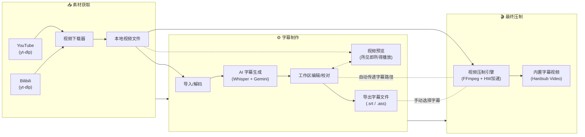
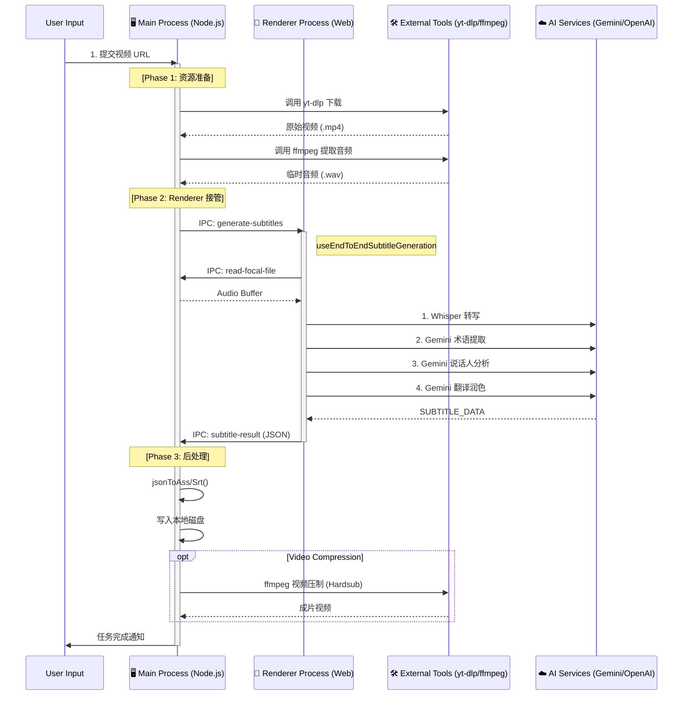
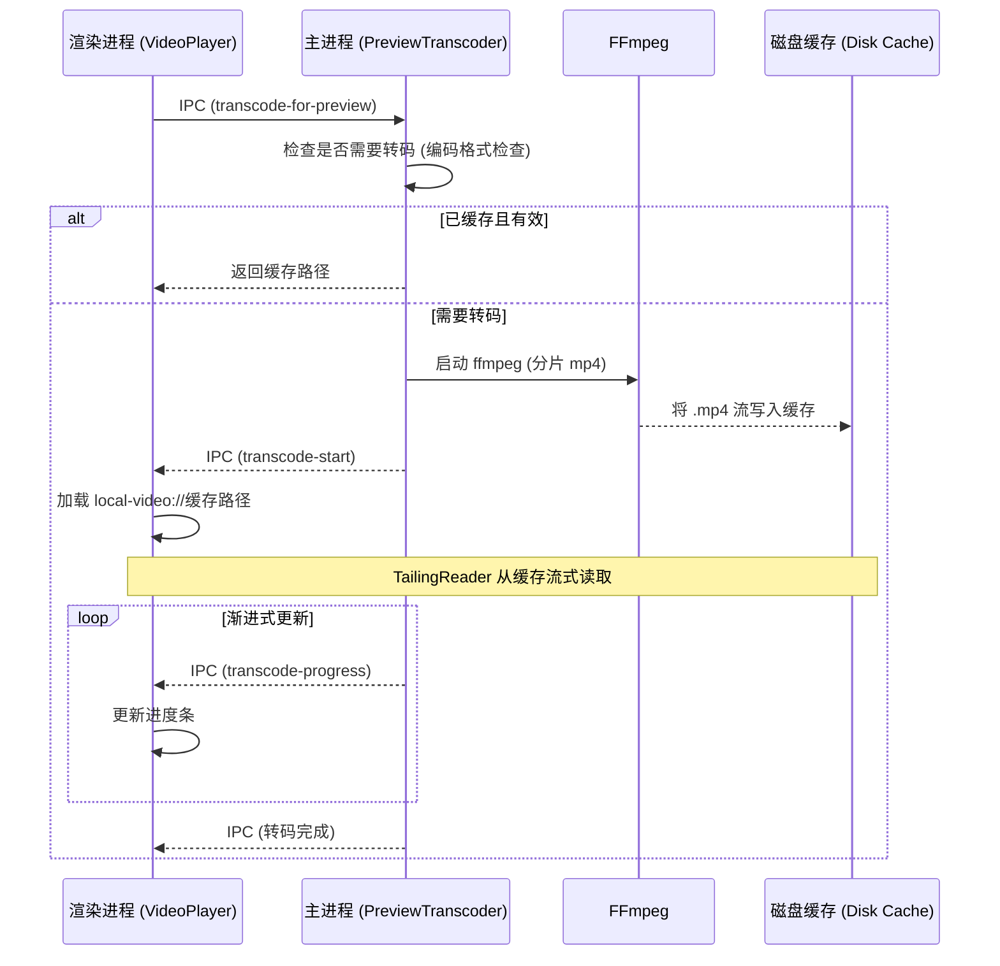

# 桌面端功能

桌面端 (Electron) 独有的功能和架构说明。

## 🖥️ 桌面端全流程 (下载-制作-压制)

桌面端独有的完整工作流，打通从素材获取到成品输出：

---

## 🚀 全自动 End-to-End 模式

这是 Electron 端独有的核心功能，通过 IPC 通信协调 主进程 (资源调度) 和 渲染进程 (AI 计算)，实现"一键熟肉"。

### 跨进程交互架构

### 数据流向与状态管理

所有中间状态和配置通过 `EndToEndWizard` 组件管理，数据流转如下：

1.  **用户配置 (Configuration)**
    - 源: `EndToEndWizard` UI
    - 流向: 通过 `IPC (start-processing)` -> 主进程 `EndToEndPipeline` 服务
    - 内容: URL, 模型选择, 翻译风格, 压制参数

2.  **音视频流 (Media Stream)**
    - `yt-dlp` -> 磁盘临时目录 -> `ffmpeg` (提取音频) -> 磁盘 WAV
    - 磁盘 WAV -> `IPC (read-file)` -> 渲染进程内存 (ArrayBuffer) -> Web Audio API

3.  **字幕数据 (Subtitle Data)**
    - 渲染进程生成 `SubtitleItem[]` 数组
    - 通过 `IPC (subtitle-result)` 回传主进程
    - 主进程将对象序列化为 ASS/SRT 格式文本并写入文件

4.  **进度反馈 (Progress Feedback)**
    - 各阶段 (下载/转写/压制) 均产生进度事件
    - 主进程 -> `IPC (progress)` -> 渲染进程 `useEndToEnd` Hook -> UI 进度条

### 关键 IPC 通道

| 通道名 (Channel)                | 方向             | 载荷 (Payload)    | 作用                               |
| :------------------------------ | :--------------- | :---------------- | :--------------------------------- |
| `end-to-end:start`              | Renderer -> Main | `EndToEndConfig`  | 启动全自动任务                     |
| `end-to-end:generate-subtitles` | Main -> Renderer | `path, config`    | 主进程准备好音频，请求前端开始生成 |
| `end-to-end:subtitle-result`    | Renderer -> Main | `SubtitleItem[]`  | 前端完成生成，返回结果             |
| `end-to-end:progress`           | Main -> Renderer | `stage, progress` | 实时进度同步                       |

---

## 🛰️ 媒体播放自定义协议

为了绕过浏览器的安全限制（CSP、沙箱）并支持大文件流式播放，桌面版实现了一个自定义协议：

### `local-video://` 协议

- **实现位置**：`electron/main.ts`
- **核心权限**：`standard`, `secure`, `stream`, `supportFetchAPI`, `bypassCSP`。
- **关键技术：Tailing Reader**：支持读取"增长中的文件"（转码进行中）。它使用轮询机制读取 FFmpeg 正在写入磁盘的新数据。

---

## 📺 视频预览与缓存策略

系统采用分片 MP4 (fragmented MP4) 转码策略，平衡兼容性与性能，实现**边转码边播放**的即时视频预览。

### 架构概览

视频预览系统由三个核心组件组成：

| 组件                     | 位置                     | 功能                                    |
| :----------------------- | :----------------------- | :-------------------------------------- |
| `VideoPlayerPreview`     | `src/components/editor/` | React 视频播放器，支持 ASS 字幕叠加渲染 |
| `useVideoPreview`        | `src/hooks/`             | 转码进度、视频源、播放状态管理          |
| `videoPreviewTranscoder` | `electron/services/`     | FFmpeg 转码服务，支持 GPU 加速与缓存    |

### 流程图

### 核心特性

| 特性               | 说明                                             |
| :----------------- | :----------------------------------------------- |
| **渐进式播放**     | 通过 fMP4 + TailingReader 实现转码未完成即可播放 |
| **GPU 加速**       | 自动检测 NVENC/QSV/VCE 以加快转码                |
| **格式检测**       | 对浏览器兼容格式 (mp4, webm, m4v) 跳过转码       |
| **所见即所得字幕** | 使用 assjs 渲染 ASS 字幕，与视频同步             |
| **浮动/停靠模式**  | 支持可调整大小的浮动窗口或停靠面板               |

### 缓存生命周期

- **存储位置**：用户数据目录 (`/preview_cache/`)。
- **限制**：自动执行总大小限制（默认 3GB）。
- **清理**：应用启动时自动检测（最旧文件优先），并支持 UI 手动清理。

### IPC 通道

| 通道名 (Channel)        | 方向            | 载荷 (Payload)                    | 作用                       |
| :---------------------- | :-------------- | :-------------------------------- | :------------------------- |
| `transcode-for-preview` | Renderer → Main | `{ filePath }`                    | 请求视频转码               |
| `transcode-start`       | Main → Renderer | `{ outputPath, duration }`        | 转码已开始，开启渐进式播放 |
| `transcode-progress`    | Main → Renderer | `{ percent, transcodedDuration }` | 实时进度更新               |
| `cache:get-size`        | Renderer → Main | -                                 | 获取预览缓存大小           |
| `cache:clear`           | Renderer → Main | -                                 | 清理预览缓存               |

---

## 🔧 桌面端服务模块

| 文件                                 | 功能描述                                      |
| ------------------------------------ | --------------------------------------------- |
| `main.ts`                            | Electron 主进程，窗口管理、IPC 通信           |
| `preload.ts`                         | 预加载脚本，暴露安全的 Node.js API            |
| `logger.ts`                          | 统一日志系统，支持文件轮转和 JSON 视图        |
| `utils/paths.ts`                     | 便携式路径解析，支持 exe 同级目录存储         |
| `services/localWhisper.ts`           | 本地 Whisper 模型调用，支持 GPU 检测          |
| `services/ffmpegAudioExtractor.ts`   | FFmpeg 音频提取                               |
| `services/ytdlp.ts`                  | 视频下载服务 (YouTube/Bilibili)               |
| `services/videoCompressor.ts`        | 视频压制，支持 NVENC/QSV/AMF 硬件加速         |
| `services/videoPreviewTranscoder.ts` | 视频预览转码、fMP4 渐进式播放、缓存管理       |
| `services/endToEndPipeline.ts`       | 全自动流水线，编排下载-转写-压制全流程        |
| `services/storage.ts`                | 便携式存储服务，配置和日志存储在 exe 同级目录 |
