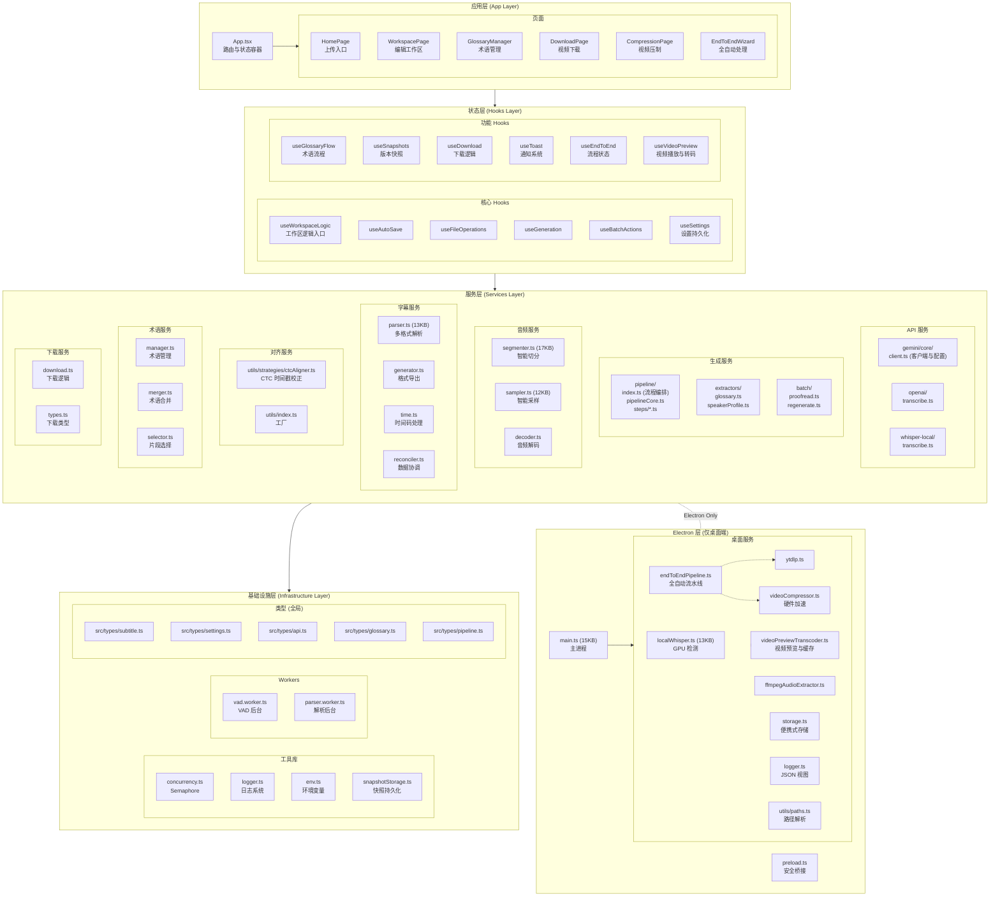
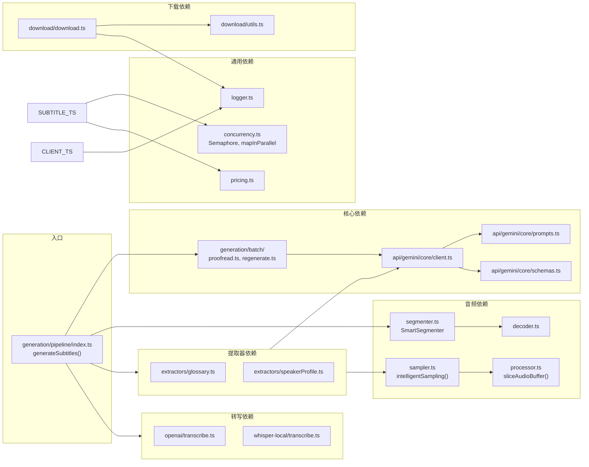

# 模块架构

## 🧱 应用模块架构



---

## 🔗 模块依赖关系



---

## 📁 目录结构

```
Gemini-Subtitle-Pro/
├── 📂 src/                          # 前端源代码
│   ├── 📄 App.tsx                   # 应用主入口
│   ├── 📄 index.tsx                 # React 渲染入口
│   ├── 📄 index.css                 # 全局样式
│   ├── 📄 i18n.ts                   # [NEW] 国际化配置入口
│   │
│   ├── 📂 components/               # UI 组件
│   │   ├── 📂 common/               # 通用业务组件 (Header, PageHeader 等)
│   │   ├── 📂 editor/               # 字幕编辑器与视频预览组件
│   │   │   ├── 📄 VideoPlayerPreview.tsx  # [NEW] 渐进式视频播放器
│   │   │   ├── 📄 RegenerateModal.tsx     # [NEW] 批量重新生成模态框
│   │   │   └── 📄 ...               # SubtitleRow, Batch 等
│   │   ├── 📂 compression/          # [NEW] 视频压制页面组件
│   │   │   ├── 📄 EncoderSelector.tsx # 编码器选择与配置
│   │   │   └── 📄 ...
│   │   ├── 📂 pages/                # 页面级组件
│   │   ├── 📂 ui/                   # 基础 UI 组件库
│   │   ├── 📂 settings/             # 设置相关组件
│   │   │   ├── 📂 tabs/             # [NEW] 模块化设置面板
│   │   │   └── 📄 SettingsModal.tsx
│   │   ├── 📂 layout/               # 布局容器
│   │   ├── 📂 modals/               # 业务弹窗
│   │   ├── 📂 endToEnd/             # 端到端向导组件
│   │   └── 📂 ...
│   │
│   ├── 📂 hooks/                    # React Hooks
│   │   ├── 📂 useWorkspaceLogic/    # 核心工作区逻辑
│   │   ├── 📄 useVideoPreview.ts    # [NEW] 视频预览与转码状态
│   │   └── ...
│   │
│   ├── 📂 locales/                  # [NEW] 国际化资源目录
│   │   ├── 📂 zh-CN/                # 简体中文
│   │   ├── 📂 en-US/                # 英语
│   │   └── 📂 ja-JP/                # 日语 (v2.13 新增)
│   │
│   ├── 📂 services/                 # 服务层 (纯逻辑)
│   │   ├── 📂 api/                  # API 集成
│   │   ├── 📂 generation/           # 生成服务
│   │   │   ├── 📂 pipeline/         # 完整流水线
│   │   │   │   ├── 📂 core/         # [NEW] 步骤基类
│   │   │   │   └── 📂 steps/        # [NEW] 步骤实现
│   │   │   ├── 📂 extractors/       # 信息提取
│   │   │   └── 📂 batch/            # 批量操作
│   │   ├── 📂 audio/                # 音频处理
│   │   ├── 📂 subtitle/             # 字幕解析与生成
│   │   │   ├── 📄 reconciler.ts     # [NEW] 数据协调器
│   │   │   └── 📄 ...
│   │   ├── 📂 glossary/             # 术语管理
│   │   ├── 📂 download/             # 视频下载
│   │   └── 📂 utils/                # 基础设施
│   │
│   ├── 📂 types/                    # 全局类型定义
│   └── 📂 config/                   # 配置文件
│       └── 📄 models.ts             # [NEW] 模型配置中心
│
├── 📂 electron/                     # Electron 桌面端代码
│   ├── 📄 main.ts                   # 主进程入口
│   ├── 📄 preload.ts                # 预加载脚本
│   └── 📂 services/                 # 桌面服务
│       ├── 📄 localWhisper.ts
│       ├── 📄 videoCompressor.ts
│       ├── 📄 videoPreviewTranscoder.ts
│       ├── 📄 endToEndPipeline.ts
│       ├── 📄 ytdlp.ts
│       └── 📂 utils/
│
├── 📂 docs/                         # 文档目录
│   ├── 📄 ARCHITECTURE_zh.md        # 中文架构文档
│   └── 📄 ARCHITECTURE.md           # 英文架构文档
│
└── 📄 package.json                  # 项目配置
```
