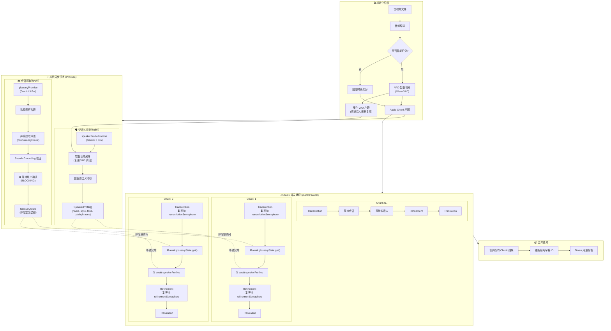
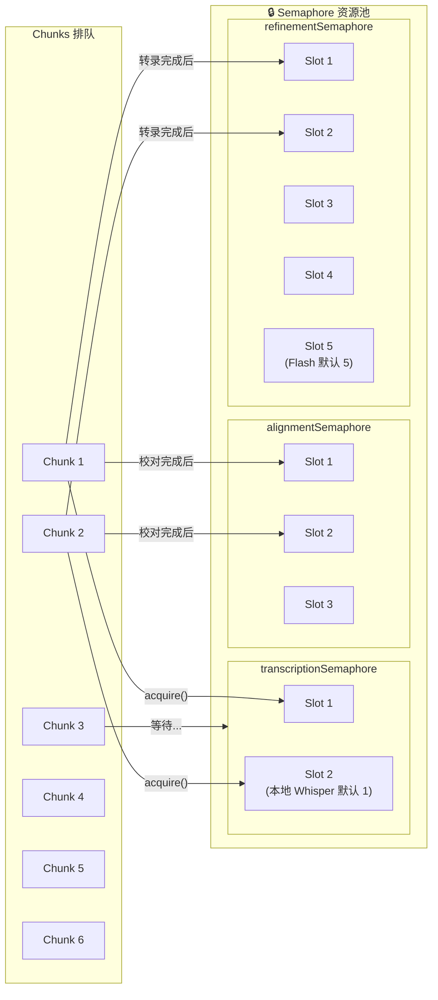
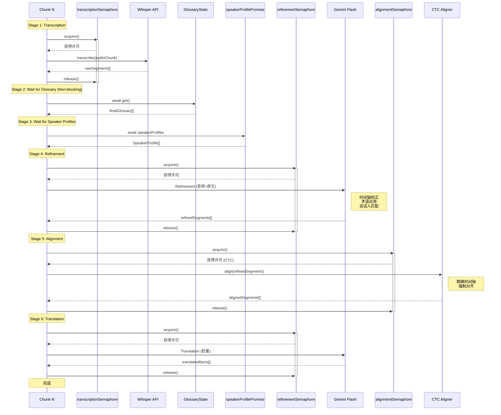
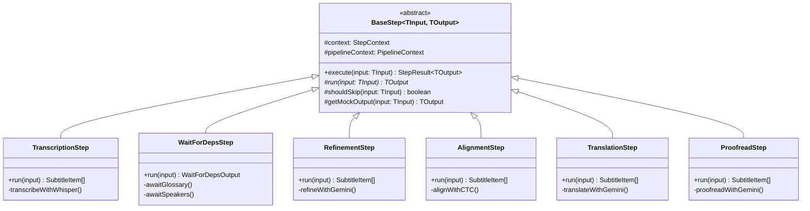
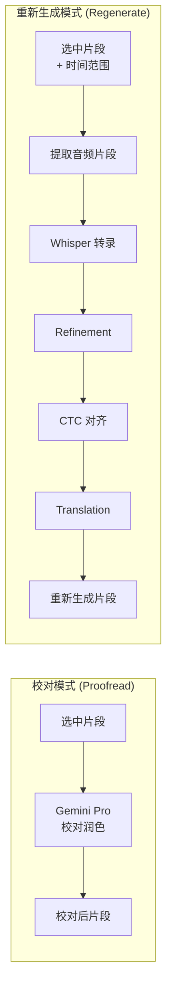
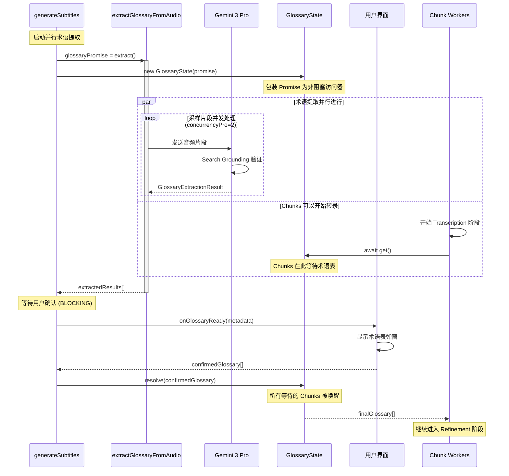
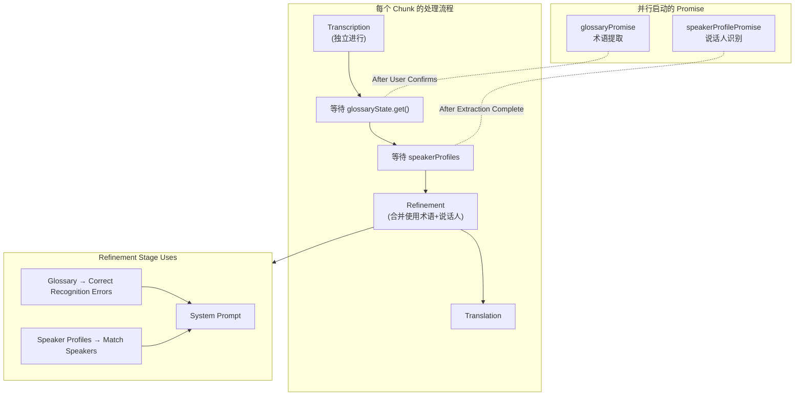

# Pipeline 流程

## 🔄 完整 Pipeline 并发架构图

下图展示了字幕生成的完整并发架构，包含并行异步任务、Semaphore 控制及任务间依赖关系：

---

## 🔒 双 Semaphore 并发控制详解

**配置说明：**

| Semaphore                | 用途                  | 默认并发数       | 配置项                 |
| ------------------------ | --------------------- | ---------------- | ---------------------- |
| `transcriptionSemaphore` | 控制 Whisper API 调用 | 本地: 1, 云端: 5 | `whisperConcurrency`   |
| `refinementSemaphore`    | 控制 Gemini Flash API | 5                | `concurrencyFlash`     |
| `alignmentSemaphore`     | 控制对齐服务          | 2                | `concurrencyAlignment` |
| (术语提取内部)           | 控制 Gemini Pro API   | 2                | `concurrencyPro`       |

---

## 📊 Chunk 内部 6 阶段流水线

---

## 🏗️ Pipeline 步骤架构 (v2.13 新增)

v2.13 引入了基于类的步骤架构，将 Chunk 处理逻辑模块化：

**步骤说明：**

| 步骤                | 文件                   | 输入             | 输出                | 用途                       |
| :------------------ | :--------------------- | :--------------- | :------------------ | :------------------------- |
| `TranscriptionStep` | `TranscriptionStep.ts` | AudioChunk       | `SubtitleItem[]`    | Whisper 语音转文字         |
| `WaitForDepsStep`   | `WaitForDepsStep.ts`   | -                | Glossary + Speakers | 等待术语表和说话人提取完成 |
| `RefinementStep`    | `RefinementStep.ts`    | `SubtitleItem[]` | `SubtitleItem[]`    | 时间轴校正、术语应用       |
| `AlignmentStep`     | `AlignmentStep.ts`     | `SubtitleItem[]` | `SubtitleItem[]`    | CTC 强制对齐               |
| `TranslationStep`   | `TranslationStep.ts`   | `SubtitleItem[]` | `SubtitleItem[]`    | AI 翻译                    |
| `ProofreadStep`     | `ProofreadStep.ts`     | `SubtitleItem[]` | `SubtitleItem[]`    | 批量校对 (可选)            |

---

## ⚖️ 批量操作对比 (v2.13 新增)

v2.13 将批量操作拆分为两种独立模式：

| 特性         | Proofread (校对)         | Regenerate (重新生成)                    |
| :----------- | :----------------------- | :--------------------------------------- |
| **文件**     | `batch/proofread.ts`     | `batch/regenerate.ts`                    |
| **用途**     | 润色和校对已有翻译       | 完全重新处理选中片段                     |
| **流程**     | 仅调用 Gemini Pro 校对   | 转录 → 润色 → 对齐 → 翻译 (完整流水线)   |
| **输入**     | 已有的 `SubtitleItem[]`  | 原始音频 + 时间范围                      |
| **保留内容** | 保留原始时间轴           | 全部重新生成                             |
| **适用场景** | 改善翻译质量、修正错别字 | 修复转录错误、重新分句、更新术语表后重跑 |
| **用户提示** | 不支持                   | 支持转录提示和翻译提示                   |
| **模型**     | Gemini 3 Pro             | Whisper + Gemini Flash                   |

---

## 🔗 Pipeline 依赖总结

| 阶段          | 依赖项                                      | 说明                   |
| :------------ | :------------------------------------------ | :--------------------- |
| Transcription | `transcriptionSemaphore`                    | 独立执行，无阻塞依赖   |
| Wait Glossary | `glossaryState.get()`                       | 必须等待术语表确认完成 |
| Wait Speakers | `speakerProfilePromise`                     | 必须等待说话人识别完成 |
| Refinement    | `refinementSemaphore` + Glossary + Speakers | 合并并使用所有数据     |
| Alignment     | `alignmentSemaphore`                        | 高精度时间轴对齐       |
| Translation   | `refinementSemaphore` (共享)                | 对齐后进行翻译         |

---

## 📚 术语提取与用户交互流程

---

## 🗣️ 说话人识别在 Pipeline 中的位置

---

## 🔄 数据完整性与协调 ("数据枢纽")

系统采用严格的 **数据协调策略** (`src/services/subtitle/reconciler.ts`) 以确保在流水线各个阶段（Refinement, Alignment, Translation）之间，即使片段数量发生变化（如拆分或合并），元数据也能保持一致。

### 协调器逻辑 (The Reconciler Logic)

`reconcile(prev, curr)` 函数充当连接流水线各个阶段的"数据枢纽"。它智能地将 `prev`（源）的元数据合并到 `curr`（新生成）的片段中：

- **语义元数据 (Semantic Metadata)** (始终继承):
  - `speaker` (说话人 ID/名称)
  - `comment` (用户备注)
  - **逻辑**: 继承自重叠率最高的 `prev` 片段。即使片段被拆分，所有子片段都会继承父片段的说话人信息。
- **内部状态 (Internal State)** (条件继承):
  - `alignmentScore` (CTC 置信度)
  - `lowConfidence` (低置信度标记)
  - `hasRegressionIssue`, `hasCorruptedRangeIssue` (错误标记)
  - **逻辑**: **仅当**检测到 **1:1 映射**时才严格继承。如果片段被拆分或合并，这些内部标记会被重置。

### 对齐策略 (CTC)

系统使用 **CTC (Connectionist Temporal Classification)** 进行高精度对齐：

- **引擎**: `ctcAligner.ts` 调用外部 `align.exe` (MMS-300m 模型)。
- **功能**: 基于音频对齐结果更新 `startTime` 和 `endTime`，但**绝不拆分或合并**片段。
- **元数据**: 为片段添加 `alignmentScore`。低于阈值的评分会触发 `lowConfidence` 标记以供用户复查。
