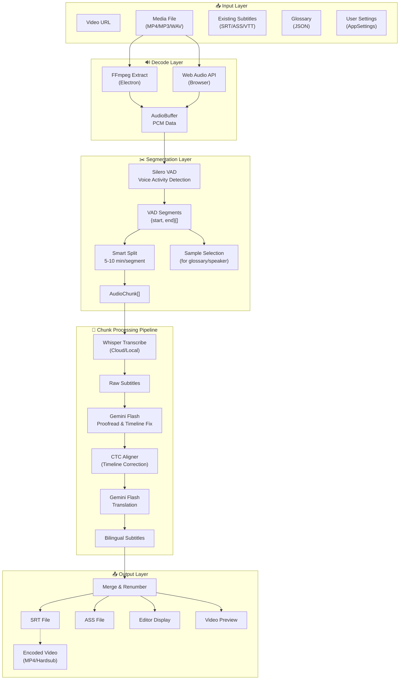
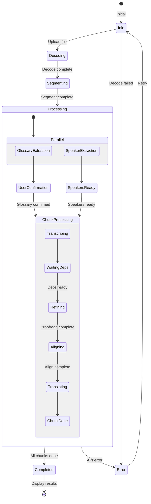
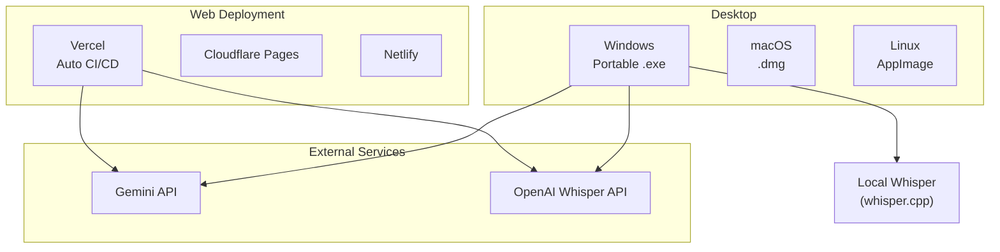

# Core Modules

Detailed documentation of core service modules.

## 1. Generation Service (`src/services/generation/`)

Core business logic module with responsibility-based separation:

| Submodule    | File/Directory          | Description                                                       |
| ------------ | ----------------------- | ----------------------------------------------------------------- |
| `pipeline`   | `index.ts`              | Generation orchestrator, coordinates full flow                    |
|              | `pipelineCore.ts`       | Shared context & dependency injection                             |
|              | `chunkProcessor.ts`     | Single chunk processing (transcribe → wait deps → translate)      |
|              | `translation.ts`        | Translation execution logic                                       |
|              | `glossaryHandler.ts`    | Glossary application logic                                        |
|              | `resultTransformers.ts` | Result transformation & post-processing                           |
|              | `core/BaseStep.ts`      | Step base class, unified interface                                |
|              | `steps/*.ts`            | Step implementations (Transcription, Refinement, Alignment, etc.) |
| `extractors` | `glossary.ts`           | Glossary extractor (Gemini Pro + Search)                          |
|              | `speakerProfile.ts`     | Speaker profile extractor                                         |
| `batch`      | `proofread.ts`          | Batch proofreading operation                                      |
|              | `regenerate.ts`         | Batch regeneration (full pipeline rerun)                          |

---

## 2. Gemini API Core (`src/services/api/gemini/core/`)

Core API interaction capabilities:

| File         | Description                                            |
| ------------ | ------------------------------------------------------ |
| `client.ts`  | Gemini API client wrapper, auth, retry, quota handling |
| `prompts.ts` | Base prompt template library                           |
| `schemas.ts` | Structured output schema definitions                   |

---

## 3. Audio Processing (`src/services/audio/`)

| File                 | Description                                                           |
| -------------------- | --------------------------------------------------------------------- |
| `segmenter.ts`       | **Smart audio segmenter**, Silero VAD for semantic boundary splitting |
| `sampler.ts`         | Audio sampling for AI analysis                                        |
| `decoder.ts`         | Multi-format audio decoding                                           |
| `processor.ts`       | Audio preprocessing, normalization                                    |
| `converter.ts`       | Audio format conversion                                               |
| `ffmpegExtractor.ts` | FFmpeg audio extraction (core logic)                                  |

---

## 4. Subtitle Processing (`src/services/subtitle/`)

| File                   | Description                            |
| ---------------------- | -------------------------------------- |
| `parser.ts`            | Subtitle parser, SRT/ASS/VTT support   |
| `generator.ts`         | Subtitle export, bilingual generation  |
| `time.ts`              | Timecode processing utilities          |
| `postCheck.ts`         | Subtitle quality post-check            |
| `timelineValidator.ts` | Timeline logic validation              |
| `reconciler.ts`        | **Data reconciler** (metadata merging) |

---

## 5. Download Service (`src/services/download/`)

| File          | Description                |
| ------------- | -------------------------- |
| `download.ts` | Video download logic       |
| `utils.ts`    | Download utility functions |

---

## 6. Model Selection Strategy

Model configuration centralized in `src/config/models.ts`:

| Processing Step      | Default Model          | Features                            |
| -------------------- | ---------------------- | ----------------------------------- |
| `refinement`         | Gemini 2.5 Flash       | Timeline correction (avoid 3.0 bug) |
| `translation`        | Gemini 3 Flash Preview | Translation, Search Grounding       |
| `glossaryExtraction` | Gemini 3 Pro Preview   | Multimodal, glossary extraction     |
| `speakerProfile`     | Gemini 3 Pro Preview   | Speaker analysis                    |
| `batchProofread`     | Gemini 3 Pro Preview   | High-quality proofreading           |

> **Note**: Since v2.13, `batchFixTimestamps` replaced by `regenerate`. Regenerate reruns full pipeline.

Per-step configuration options:

- `thinkingLevel`: Thinking depth (`none`/`low`/`medium`/`high`)
- `useSearch`: Enable Google Search
- `maxOutputTokens`: Maximum output tokens

---

## 7. i18n Module (`src/locales/`, `src/i18n.ts`)

Full internationalization with i18next, supporting Chinese/English/Japanese:

| File/Directory | Description                                   |
| -------------- | --------------------------------------------- |
| `i18n.ts`      | i18n config entry, initialize i18next + React |
| `locales/`     | Translation resource root                     |
| `zh-CN/`       | Simplified Chinese, 14 namespace files        |
| `en-US/`       | English, same structure as zh-CN              |
| `ja-JP/`       | Japanese (v2.13)                              |

**Namespace Organization:**

| Namespace     | Content                               |
| ------------- | ------------------------------------- |
| `common`      | Common text (buttons, labels, errors) |
| `home`        | Home page                             |
| `workspace`   | Workspace page                        |
| `editor`      | Subtitle editor                       |
| `settings`    | Settings modal                        |
| `endToEnd`    | End-to-end wizard                     |
| `modals`      | Business modals                       |
| `services`    | API service messages                  |
| `compression` | Video encoding page                   |
| `download`    | Download page                         |
| `progress`    | Progress indicators                   |
| `ui`          | UI components                         |
| `app`         | Application-level text                |

---

## 8. Settings Module (`src/components/settings/`)

v2.13 refactored into modular tabs structure:

| File/Directory             | Description                                     |
| -------------------------- | ----------------------------------------------- |
| `SettingsModal.tsx`        | Settings modal container, tab management        |
| `tabs/GeneralTab.tsx`      | General settings (language, theme)              |
| `tabs/ServicesTab.tsx`     | API service config (Gemini, OpenAI keys)        |
| `tabs/EnhanceTab.tsx`      | Enhancement features (glossary, speaker toggle) |
| `tabs/PerformanceTab.tsx`  | Performance settings (concurrency, cache)       |
| `tabs/DebugTab.tsx`        | Debug options (mock mode, log level)            |
| `tabs/AboutTab.tsx`        | About page (version, Whisper status, GPU)       |
| `AlignmentSettings.tsx`    | Alignment service config                        |
| `LocalWhisperSettings.tsx` | Local Whisper config                            |
| `CacheManagement.tsx`      | Cache management UI                             |

---

## 📊 Data Flow Architecture

### Main Data Flow



### State Flow



---

## 🚀 Deployment Architecture



---

## 📝 Development Guide

### Requirements

- Node.js 18+
- npm or yarn

### Quick Start

```bash
# Install dependencies
yarn install

# Web development mode
yarn dev

# Electron development mode
yarn electron:dev

# Build Electron app
yarn electron:build
```

### Environment Variables

```bash
GEMINI_API_KEY=your_gemini_key    # Required: Translation & proofreading
OPENAI_API_KEY=your_openai_key    # Optional: Online Whisper
```

---

## 📚 References

- [Google Gemini API Docs](https://ai.google.dev/docs)
- [OpenAI Whisper API](https://platform.openai.com/docs/guides/speech-to-text)
- [whisper.cpp Project](https://github.com/ggerganov/whisper.cpp)
- [Silero VAD](https://github.com/snakers4/silero-vad)
