# Desktop Features

Desktop (Electron) specific features and architecture.

## 🖥️ Complete Desktop Workflow (Download-Create-Encode)

Desktop-exclusive complete workflow from source acquisition to final output:

```mermaid
flowchart LR
    subgraph DOWNLOAD["📥 Source Acquisition"]
        direction TB
        YTB["YouTube<br/>(yt-dlp)"]
        BILI["Bilibili<br/>(yt-dlp)"]
        LOCAL_FILE["Local Video File"]

        YTB --> DOWNLOADER["Video Downloader"]
        BILI --> DOWNLOADER
        DOWNLOADER --> LOCAL_FILE
    end

    subgraph PROCESS["⚙️ Subtitle Creation"]
        direction TB
        LOCAL_FILE --> IMPORT["Import/Decode"]
        IMPORT --> GEN["AI Subtitle Generation<br/>(Whisper + Gemini)"]
        GEN --> EDIT["Workspace Edit/Proofread"]
        LOCAL_FILE -.-> PREVIEW["Video Preview<br/>(WYSIWYG)"]
        EDIT <-.-> PREVIEW

        EDIT --> SRT_ASS["Export Subtitle<br/>(.srt / .ass)"]
    end

    subgraph COMPRESS["🎬 Final Encoding"]
        direction TB
        LOCAL_FILE --> COMPRESSOR["Video Encoder<br/>(FFmpeg + HW Accel)"]
        EDIT -.-|"Auto-pass subtitle path"| COMPRESSOR
        SRT_ASS -.-|"Manual select"| COMPRESSOR

        COMPRESSOR --> OUTPUT["Hardsubbed Video<br/>(Hardsub Video)"]
    end

    DOWNLOAD --> PROCESS
    PROCESS --> COMPRESS
```

---

## 🚀 Full-Auto End-to-End Mode

This is an Electron-exclusive core feature, coordinating Main Process (resource scheduling) and Renderer Process (AI computation) via IPC for "one-click hardsub".

### Cross-Process Interaction Architecture

```mermaid
sequenceDiagram
    participant User as User Input
    participant Main as 🖥️ Main Process (Node.js)
    participant Renderer as 🎨 Renderer Process (Web)
    participant Ext as 🛠️ External Tools (yt-dlp/ffmpeg)
    participant AI as ☁️ AI Services (Gemini/OpenAI)

    User->>Main: 1. Submit Video URL
    activate Main

    note over Main: [Phase 1: Resource Preparation]
    Main->>Ext: Call yt-dlp download
    Ext-->>Main: Original video (.mp4)
    Main->>Ext: Call ffmpeg extract audio
    Ext-->>Main: Temp audio (.wav)

    note over Main: [Phase 2: Renderer Takes Over]
    Main->>Renderer: IPC: generate-subtitles
    activate Renderer

    note right of Renderer: useEndToEndSubtitleGeneration
    Renderer->>Main: IPC: read-focal-file
    Main-->>Renderer: Audio Buffer

    Renderer->>AI: 1. Whisper Transcription
    Renderer->>AI: 2. Gemini Glossary Extraction
    Renderer->>AI: 3. Gemini Speaker Analysis
    Renderer->>AI: 4. Gemini Translation

    AI-->>Renderer: SUBTITLE_DATA

    Renderer->>Main: IPC: subtitle-result (JSON)
    deactivate Renderer

    note over Main: [Phase 3: Post-processing]
    Main->>Main: jsonToAss/Srt()
    Main->>Main: Write to disk

    opt Video Compression
        Main->>Ext: ffmpeg video encode (Hardsub)
        Ext-->>Main: Final video
    end

    Main->>User: Task complete notification
    deactivate Main
```

### Key IPC Channels

| Channel                         | Direction        | Payload           | Purpose                            |
| :------------------------------ | :--------------- | :---------------- | :--------------------------------- |
| `end-to-end:start`              | Renderer -> Main | `EndToEndConfig`  | Start full-auto task               |
| `end-to-end:generate-subtitles` | Main -> Renderer | `path, config`    | Main ready, request generation     |
| `end-to-end:subtitle-result`    | Renderer -> Main | `SubtitleItem[]`  | Generation complete, return result |
| `end-to-end:progress`           | Main -> Renderer | `stage, progress` | Real-time progress sync            |

---

## 🛰️ Custom Media Protocol

To bypass browser security restrictions (CSP, sandbox) and support large file streaming:

### `local-video://` Protocol

- **Location**: `electron/main.ts`
- **Core Permissions**: `standard`, `secure`, `stream`, `supportFetchAPI`, `bypassCSP`
- **Key Tech - Tailing Reader**: Supports reading "growing files" (transcoding in progress). Uses polling to read new data FFmpeg is writing to disk.

---

## 📺 Video Preview & Cache Strategy

System uses fragmented MP4 (fMP4) transcoding strategy for **progressive playback** during transcoding.

### Architecture Overview

| Component                | Location                 | Function                                |
| :----------------------- | :----------------------- | :-------------------------------------- |
| `VideoPlayerPreview`     | `src/components/editor/` | React player, ASS subtitle overlay      |
| `useVideoPreview`        | `src/hooks/`             | Transcode progress, video source, state |
| `videoPreviewTranscoder` | `electron/services/`     | FFmpeg transcoding, GPU accel, caching  |

### Flow Diagram

### Core Features

| Feature               | Description                                          |
| :-------------------- | :--------------------------------------------------- |
| **Progressive Play**  | Play before transcoding completes via fMP4 + Tailing |
| **GPU Acceleration**  | Auto-detect NVENC/QSV/VCE for faster transcoding     |
| **Format Detection**  | Skip transcoding for browser-compatible formats      |
| **WYSIWYG Subtitles** | Real-time ASS rendering with assjs                   |
| **Float/Dock Mode**   | Resizable floating window or docked panel            |

### Cache Lifecycle

- **Location**: User data directory (`/preview_cache/`)
- **Limit**: Auto-enforce total size limit (default 3GB)
- **Cleanup**: Auto-detect on startup (oldest first), UI manual cleanup

### IPC Channels

| Channel                 | Direction       | Payload                           | Purpose                   |
| :---------------------- | :-------------- | :-------------------------------- | :------------------------ |
| `transcode-for-preview` | Renderer → Main | `{ filePath }`                    | Request video transcoding |
| `transcode-start`       | Main → Renderer | `{ outputPath, duration }`        | Transcoding started       |
| `transcode-progress`    | Main → Renderer | `{ percent, transcodedDuration }` | Real-time progress        |
| `cache:get-size`        | Renderer → Main | -                                 | Get preview cache size    |
| `cache:clear`           | Renderer → Main | -                                 | Clear preview cache       |

---

## 🔧 Desktop Service Modules

| File                                 | Description                                    |
| ------------------------------------ | ---------------------------------------------- |
| `main.ts`                            | Electron main process, window & IPC            |
| `preload.ts`                         | Preload script, secure Node.js API exposure    |
| `logger.ts`                          | Unified logging, file rotation, JSON view      |
| `utils/paths.ts`                     | Portable path resolution, exe-relative storage |
| `services/localWhisper.ts`           | Local Whisper, GPU detection                   |
| `services/ffmpegAudioExtractor.ts`   | FFmpeg audio extraction                        |
| `services/ytdlp.ts`                  | Video download (YouTube/Bilibili)              |
| `services/videoCompressor.ts`        | Video encoding, NVENC/QSV/AMF acceleration     |
| `services/videoPreviewTranscoder.ts` | Preview transcoding, fMP4, caching             |
| `services/endToEndPipeline.ts`       | Full automation pipeline                       |
| `services/storage.ts`                | Portable storage, exe-relative config/logs     |
