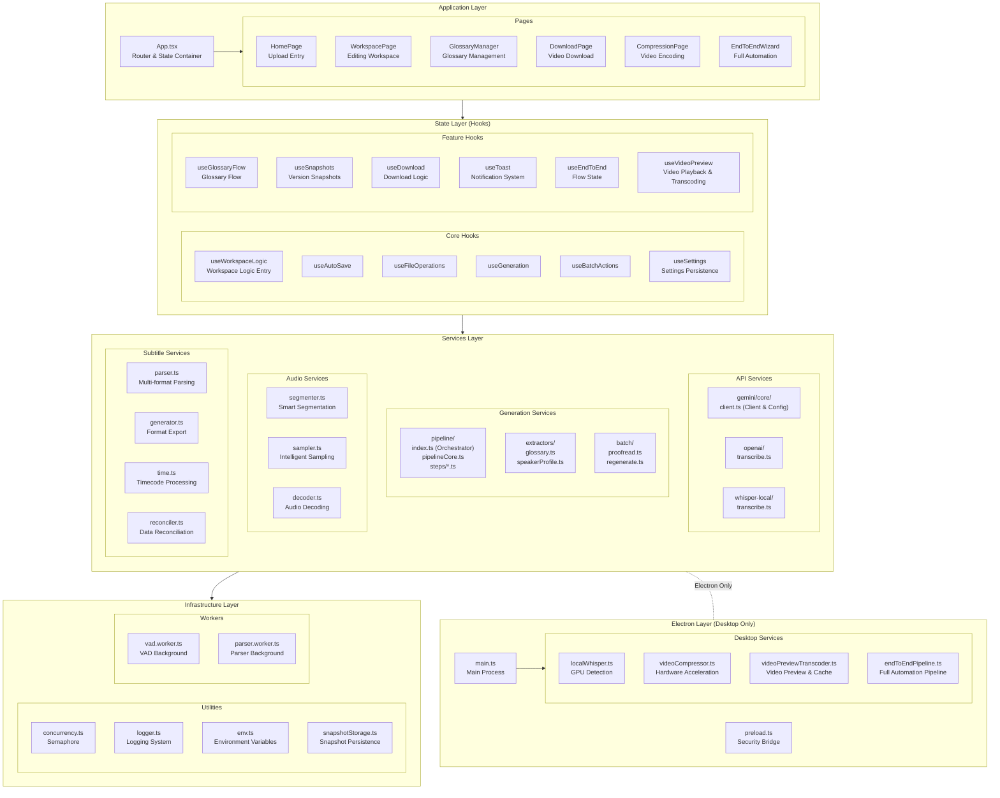
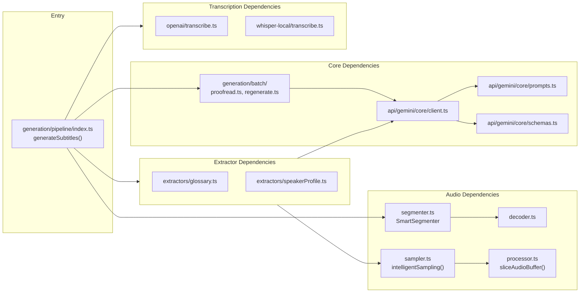

# Module Architecture

## 🧱 Application Module Architecture



---

## 🔗 Module Dependencies



---

## 📁 Directory Structure

```
Gemini-Subtitle-Pro/
├── 📂 src/                          # Frontend source code
│   ├── 📄 App.tsx                   # Application entry
│   ├── 📄 index.tsx                 # React render entry
│   ├── 📄 index.css                 # Global styles
│   ├── 📄 i18n.ts                   # i18n configuration
│   │
│   ├── 📂 components/               # UI Components
│   │   ├── 📂 common/               # Common business components
│   │   ├── 📂 editor/               # Subtitle editor & video preview
│   │   │   ├── 📄 VideoPlayerPreview.tsx  # Progressive video player
│   │   │   ├── 📄 RegenerateModal.tsx     # Batch regenerate modal
│   │   │   └── ...
│   │   ├── 📂 compression/          # Video encoding components
│   │   ├── 📂 pages/                # Page-level components
│   │   ├── 📂 ui/                   # Base UI component library
│   │   ├── 📂 settings/             # Settings components
│   │   ├── 📂 layout/               # Layout containers
│   │   ├── 📂 modals/               # Business modals
│   │   └── 📂 endToEnd/             # End-to-end wizard components
│   │
│   ├── 📂 hooks/                    # React Hooks
│   │   ├── 📂 useWorkspaceLogic/    # Core workspace logic
│   │   ├── 📄 useVideoPreview.ts    # Video preview & transcoding state
│   │   └── ...
│   │
│   ├── 📂 locales/                  # i18n resources
│   │   ├── 📂 zh-CN/                # Simplified Chinese
│   │   ├── 📂 en-US/                # English
│   │   └── 📂 ja-JP/                # Japanese (v2.13)
│   │
│   ├── 📂 services/                 # Service layer (pure logic)
│   │   ├── 📂 api/                  # API integration
│   │   ├── 📂 generation/           # Generation services
│   │   │   ├── 📂 pipeline/         # Complete pipeline
│   │   │   │   ├── 📂 core/         # Step base classes
│   │   │   │   └── 📂 steps/        # Step implementations
│   │   │   ├── 📂 extractors/       # Information extraction
│   │   │   └── 📂 batch/            # Batch operations
│   │   ├── 📂 audio/                # Audio processing
│   │   ├── 📂 subtitle/             # Subtitle parsing & generation
│   │   │   ├── 📄 reconciler.ts     # Data reconciler
│   │   │   └── ...
│   │   └── 📂 utils/                # Infrastructure
│   │
│   ├── 📂 types/                    # Global type definitions
│   └── 📂 config/                   # Configuration files
│       └── 📄 models.ts             # Model configuration center
│
├── 📂 electron/                     # Electron desktop code
│   ├── 📄 main.ts                   # Main process entry
│   ├── 📄 preload.ts                # Preload script
│   └── 📂 services/                 # Desktop services
│
├── 📂 docs/                         # Documentation
│   ├── 📄 ARCHITECTURE_zh.md        # Chinese architecture docs
│   └── 📄 ARCHITECTURE.md           # English architecture docs
│
└── 📄 package.json                  # Project configuration
```
