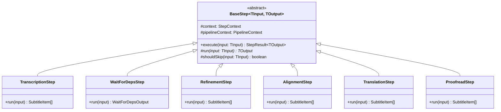

# Pipeline Flow

## 🔄 Complete Pipeline Concurrent Architecture

The following diagram shows the complete concurrent architecture of subtitle generation, including parallel async tasks, Semaphore control, and inter-task dependencies:

```mermaid
flowchart TB
    subgraph INIT["🎬 Initialization Phase"]
        A[Audio/Video File] --> B[Audio Decode]
        B --> C{Smart Split?}
        C -->|Yes| D["VAD Smart Split<br/>(Silero VAD)"]
        C -->|No| E[Fixed Duration Split]
        D --> F[Audio Chunk List]
        E --> F
        D --> G["Cache VAD Segments<br/>(for speaker sampling reuse)"]
    end

    subgraph PARALLEL["⚡ Parallel Async Tasks (Promise)"]
        direction TB

        subgraph GLOSSARY["📚 Glossary Extraction Pipeline"]
            H["glossaryPromise<br/>(Gemini 3 Pro)"]
            H --> I[Select Sample Segments]
            I --> J["Concurrent Extraction<br/>(concurrencyPro=2)"]
            J --> K[Search Grounding Validation]
            K --> L["⏸️ Await User Confirmation<br/>(BLOCKING)"]
            L --> M["GlossaryState<br/>(Non-blocking Wrapper)"]
        end

        subgraph SPEAKER["🗣️ Speaker Recognition Pipeline"]
            N["speakerProfilePromise<br/>(Gemini 3 Pro)"]
            N --> O["Intelligent Audio Sampling<br/>(Reuse VAD Segments)"]
            O --> P[Extract Speaker Features]
            P --> Q["SpeakerProfile[]<br/>{name, style, tone, catchphrases}"]
        end
    end

    subgraph CHUNKS["🔄 Chunk Concurrent Processing (mapInParallel)"]
        direction TB

        subgraph CHUNK1["Chunk 1"]
            C1_T["Transcription<br/>⏳ await transcriptionSemaphore"]
            C1_T --> C1_G["⏳ await glossaryState.get()"]
            C1_G --> C1_S["⏳ await speakerProfiles"]
            C1_S --> C1_R["Refinement<br/>⏳ await refinementSemaphore"]
            C1_R --> C1_TR[Translation]
        end

        subgraph CHUNK2["Chunk 2"]
            C2_T["Transcription<br/>⏳ await transcriptionSemaphore"]
            C2_T --> C2_G["⏳ await glossaryState.get()"]
            C2_G --> C2_S["⏳ await speakerProfiles"]
            C2_S --> C2_R["Refinement<br/>⏳ await refinementSemaphore"]
            C2_R --> C2_TR[Translation]
        end
    end

    F --> PARALLEL
    G --> O
    F --> CHUNKS
    M -.-|"Non-blocking Access"| C1_G
    Q -.-|"Wait for Completion"| C1_S

    subgraph MERGE["📦 Merge Results"]
        R[Merge All Chunk Results]
        R --> S[Re-number Subtitle IDs]
        S --> T[Token Usage Report]
    end

    CHUNKS --> MERGE
```

---

## 🔒 Dual Semaphore Concurrency Control

**Configuration:**

| Semaphore                | Purpose              | Default Concurrency | Config Key             |
| ------------------------ | -------------------- | ------------------- | ---------------------- |
| `transcriptionSemaphore` | Control Whisper API  | Local: 1, Cloud: 5  | `whisperConcurrency`   |
| `refinementSemaphore`    | Control Gemini Flash | 5                   | `concurrencyFlash`     |
| `alignmentSemaphore`     | Control Alignment    | 2                   | `concurrencyAlignment` |
| (Glossary internal)      | Control Gemini Pro   | 2                   | `concurrencyPro`       |

---

## 📊 6-Stage Chunk Pipeline

---

## 🏗️ Pipeline Step Architecture (v2.13)

v2.13 introduced class-based step architecture, modularizing Chunk processing logic:

**Step Descriptions:**

| Step                | File                   | Input            | Output              | Purpose                        |
| :------------------ | :--------------------- | :--------------- | :------------------ | :----------------------------- |
| `TranscriptionStep` | `TranscriptionStep.ts` | AudioChunk       | `SubtitleItem[]`    | Whisper speech-to-text         |
| `WaitForDepsStep`   | `WaitForDepsStep.ts`   | -                | Glossary + Speakers | Wait for extraction completion |
| `RefinementStep`    | `RefinementStep.ts`    | `SubtitleItem[]` | `SubtitleItem[]`    | Timeline correction, term app  |
| `AlignmentStep`     | `AlignmentStep.ts`     | `SubtitleItem[]` | `SubtitleItem[]`    | CTC forced alignment           |
| `TranslationStep`   | `TranslationStep.ts`   | `SubtitleItem[]` | `SubtitleItem[]`    | AI translation                 |
| `ProofreadStep`     | `ProofreadStep.ts`     | `SubtitleItem[]` | `SubtitleItem[]`    | Batch proofreading (optional)  |

---

## ⚖️ Batch Operations Comparison (v2.13)

| Feature       | Proofread                    | Regenerate                                        |
| :------------ | :--------------------------- | :------------------------------------------------ |
| **File**      | `batch/proofread.ts`         | `batch/regenerate.ts`                             |
| **Purpose**   | Polish existing translations | Completely reprocess segments                     |
| **Flow**      | Gemini Pro only              | Full pipeline (Transcribe→Refine→Align→Translate) |
| **Input**     | Existing `SubtitleItem[]`    | Original audio + time range                       |
| **Preserves** | Original timestamps          | Nothing (regenerates all)                         |
| **Use Case**  | Improve translation quality  | Fix transcription errors, re-segment              |
| **Model**     | Gemini 3 Pro                 | Whisper + Gemini Flash                            |

---

## 🔄 Data Integrity & Reconciliation

The system uses strict **data reconciliation strategy** (`src/services/subtitle/reconciler.ts`) to ensure metadata consistency across pipeline stages.

### Reconciler Logic

`reconcile(prev, curr)` function acts as the "data hub" connecting pipeline stages:

- **Semantic Metadata** (always inherited):
  - `speaker` (Speaker ID/Name)
  - `comment` (User notes)
  - **Logic**: Inherited from `prev` segment with highest overlap. Even split segments inherit parent's speaker.
- **Internal State** (conditionally inherited):
  - `alignmentScore` (CTC confidence)
  - `lowConfidence` (Low confidence flag)
  - **Logic**: Strictly inherited **only when** 1:1 mapping detected. Reset if segments are split/merged.

### Alignment Strategy (CTC)

- **Engine**: `ctcAligner.ts` calls external `align.exe` (MMS-300m model)
- **Function**: Updates `startTime` and `endTime` based on audio alignment, but **never splits or merges** segments
- **Metadata**: Adds `alignmentScore`. Scores below threshold trigger `lowConfidence` flag
